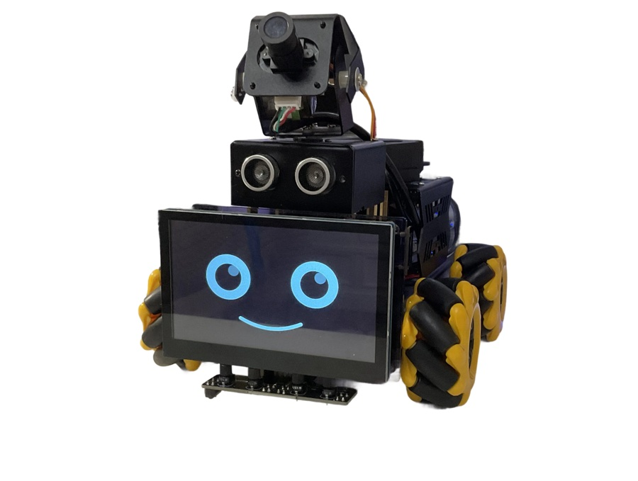
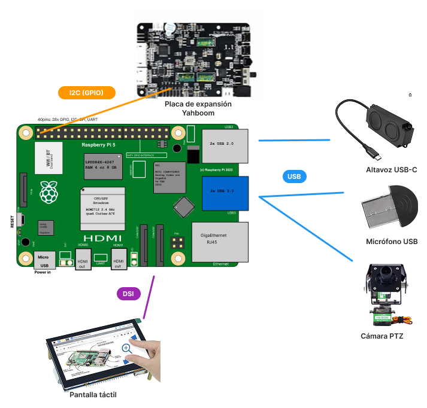
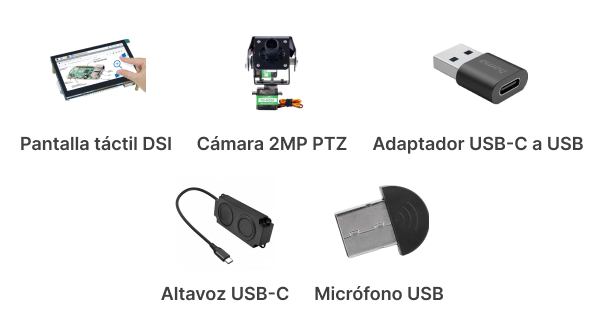
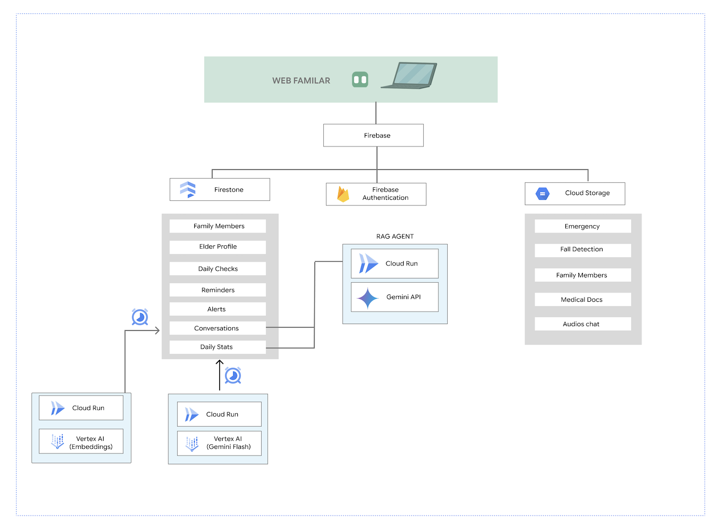
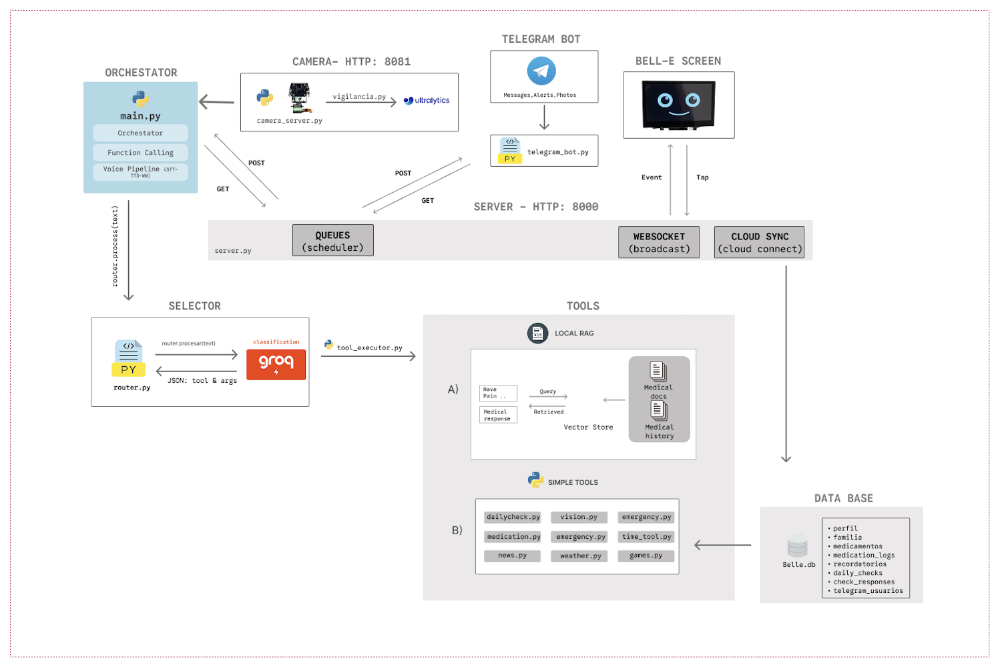

<div align="center">

# Belle Assistant

Voice assistant robot for elderly care, built on a Raspberry Pi 5. Belle listens, talks, reminds, plays games, answers health questions and keeps the family connected.




</div>

## Table of Contents

- [About](#about)
- [Hardware](#hardware)
- [Software](#software)
- [Getting Started](#getting-started)
- [Repository Structure](#repository-structure)
- [Demo Videos](#demo-videos)
- [Contact](#contact)

## About

Belle is a voice-first assistant designed for elderly people living alone. After hearing its wake word, it understands natural language and can answer health questions over the person's own medical reports, manage reminders and medication, play cognitive games, stream radio and news, detect falls with its camera and alert the family through Telegram and a companion web app.

Developed as a Bachelor's Thesis (TFG) in Computer Engineering.

## Hardware

Belle runs on a Raspberry Pi 5 mounted on a Yahboom Raspbot V2 chassis. The expansion board drives the LED ring and the pan/tilt servos over I2C, while the screen, camera, speaker and microphone connect directly to the Pi.

<div align="center">
  
</div>

<div align="center">
  
</div>

### Components

| Component | Purpose | Where to buy |
|---|---|---|
| Raspberry Pi 5 (8 GB) | Main computer | — |
| Yahboom Raspbot V2 | Chassis, expansion board, LED ring and servos | — |
| DSI touchscreen | Belle's face and kiosk UI | — |
| 2MP PTZ camera | Vision and fall detection | — |
| USB-C speaker | Belle's voice | — |
| USB microphone | Voice capture | — |
| USB-C to USB adapter | Speaker connection | — |

## Software

### APIs

| API | Used for |
|---|---|
| [Groq](https://groq.com) | Speech-to-text (Whisper) and intent classification + conversation (LLaMA 3.3 70B) |
| [ElevenLabs](https://elevenlabs.io) | Text-to-speech, Belle's voice |
| [Google Gemini](https://ai.google.dev) | Image description and fall confirmation |
| [Telegram Bot API](https://core.telegram.org/bots) | Family alerts and messaging |
| [WeatherAPI](https://www.weatherapi.com) | Weather forecasts |

### Cloud

The family web app is built on Firebase: Firestore keeps the elder profile, reminders, medications and alerts in real-time sync with the robot's local SQLite database, Cloud Storage holds photos and medical documents, and Cloud Run with Vertex AI powers the web RAG agent.

<div align="center">
  
</div>

### On the robot

Health questions are answered locally with a RAG pipeline: the medical PDFs are chunked, anonymized and indexed with FAISS using local embeddings, so personal data never leaves the device.

## Getting Started

```bash
# 1. Clone
git clone https://github.com/martinagg7/Belle_Assistant.git
cd Belle_Assistant

# 2. Main environment
python -m venv venv
source venv/bin/activate
pip install -r requirements.txt

# 3. Camera environment (OpenCV + YOLO)
python -m venv venv_camera
venv_camera/bin/pip install -r requirements-camera.txt

# 4. Configuration
cp .env.example .env        # fill in your API keys
# add your belle-service-account.json (Firebase Admin)

# 5. Database and RAG index
python data/create_db.py
python -m rag.build_index

# 6. Run everything
./start.sh
```

## Repository Structure

```
Belle_Assistant/
├── main.py            # entry point, voice loop
├── config.py          # central configuration
├── core/              # router, LLM client, tool executor, workers
├── voice/             # wake word, STT, TTS
├── tools/             # reminders, health, games, radio, emergency...
├── rag/               # health RAG pipeline (FAISS + embeddings)
├── services/          # FastAPI server, cloud sync, Telegram bot
├── camera/            # camera server and fall detection
├── hardware/          # LED ring and servo control
├── app/               # kiosk web app (Belle's face)
├── data/              # SQLite schema
└── prompts/           # LLM prompts
```

<div align="center">
  
</div>

## Demo Videos

Test recordings of Belle working (wake word, conversations, reminders, games, fall detection) are available in this [OneDrive folder](https://onedrive.live.com/?id=%2Fpersonal%2F1ff4055ac1f72fa6%2FDocuments%2FTFG%2FVideos&viewid=1a5fbf1c%2D5062%2D47b7%2D95c1%2D5cdfa9650b2e&view=0).

## Contact

**Martina García González** — Universidad Alfonso X el Sabio (UAX)

- Email: martinagg@myuax.com
- LinkedIn: [linkedin.com/in/martinagarciagonzalez](https://www.linkedin.com/in/martinagarciagonzalez/)
